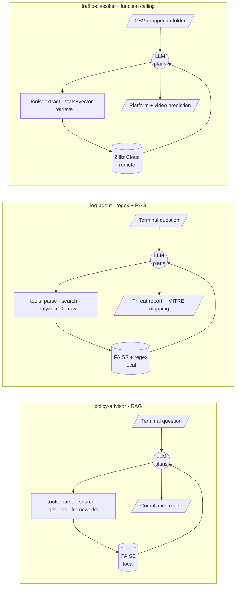

# AI Agent Patterns


[](#licensing-note)

Three small AI agents, each wired with a **different agent architecture**, living in one
workspace behind a shared launcher. It's a hands-on comparison of how the same
"LLM + tools" idea can be built three different ways.

```
AI-Agent/
├── run.sh                  # one launcher (menu 1/2/3/4)
├── policy-advisor/         # RAG compliance advisor  (LangChain 1.x)
├── log-agent/              # security log analyzer    (LangChain 0.3.x)
└── traffic-classifier/     # video-traffic classifier (raw OpenAI function calling)
```

Each subfolder is an **independent project with its own virtualenv** — they don't share
dependencies (in fact policy-advisor and log-agent pin incompatible LangChain majors).

---

## At a glance

| | policy-advisor | log-agent | traffic-classifier |
|---|---|---|---|
| Task | Gap-check policy docs against pluggable frameworks (GDPR / HIPAA / ISO 27001 / APP) | Read system logs, detect brute force / failed logins | Classify video traffic as Netflix / Stan / YouTube |
| **Framework** | LangChain 1.x | LangChain 0.3.x | raw OpenAI function calling |
| **Trigger** | terminal Q&A + one-shot CLI | terminal Q&A | folder watcher (watchdog) |
| **Retrieval** | local FAISS | local FAISS + regex | external Zilliz Cloud |
| Tools | 6 | 4 (incl. 10 analysis types) | 3 |
| Model | gpt-5-nano | gpt-5-nano | gpt-4o-mini |
| Extra | compliance gap analysis | PII masking + MITRE ATT&CK | label-leak protection |

> The three virtualenvs are deliberately isolated: policy-advisor uses LangChain **1.x**,
> log-agent uses **0.3.x** (the two can't coexist in one env), traffic-classifier uses no LangChain.

---

## How each agent is wired

Same core loop everywhere — the LLM plans, calls tools, reads a store, then answers — but the
trigger, the tool set, and the backing store differ per agent.



| | Trigger | Backing store | Framework |
|---|---|---|---|
| policy-advisor | terminal Q&A | FAISS (local) | LangChain 1.x |
| log-agent | terminal Q&A | FAISS + regex (local) | LangChain 0.3.x |
| traffic-classifier | folder watcher | Zilliz Cloud (remote) | raw OpenAI function calling |

---

## Quick start

```bash
cd AI-Agent
./run.sh                 # interactive menu
# or directly:
./run.sh policy          # policy-advisor
./run.sh log             # log-agent
./run.sh mask            # log-agent (PII-masking mode)
./run.sh traffic         # traffic-classifier
```

`run.sh` checks each agent's virtualenv, ensures a `.env` exists (creating it from
`.env.example` if missing), and blocks with a clear message if any required key is
still unset — only then does it launch the agent.

---

## Configuring keys

Every agent needs a `.env` file in its own folder:

```bash
cd <agent-folder>
cp .env.example .env     # then edit .env with real values
```

- **policy-advisor / log-agent** need only `OPENAI_API_KEY`.
- **traffic-classifier** needs three: `OPENAI_API_KEY`, `ZILLIZ_URI`, `ZILLIZ_TOKEN`.

`.env` files are gitignored — keep your real keys out of version control.

---

## 1. policy-advisor — RAG compliance advisor

A LangChain RAG + tool-calling agent. It chunks policy documents (PDF or plain text)
into a FAISS vector store, loads a compliance framework definition, retrieves evidence
for every principle via multi-query search, then reports each principle as
COVERED / PARTIAL / GAP with citations.

**Frameworks are pluggable data, not code.** Each framework is a JSON file in
`policy-advisor/frameworks/` (id, name, source, principles with retrieval queries and
expectations), validated at load time. Shipped: **GDPR**, **HIPAA**, **ISO 27001** and
the **Australian Privacy Principles** (the 13 APPs of the Privacy Act 1988). Adding a
framework means adding a data file — the agent loop and gap-analysis engine stay
unchanged. The APP definition is marked draft pending legal review; see `review_notes`
in `frameworks/app.json` for exactly which statutory details are simplified.

**Tools:** `parse_policy_documents` (parse + index), `search_policy` (semantic search,
supports comma-separated multi-queries), `get_full_document` (fetch full text),
`list_compliance_frameworks`, `get_framework_requirements`, and
`gather_compliance_evidence` (per-principle retrieval in one call).

**Before running:** drop your own policy files (`.pdf`/`.txt`) into
`policy-advisor/policy_documents/`.

```bash
./run.sh policy                                       # interactive Q&A

cd policy-advisor
./venv/bin/python agent.py --list-frameworks          # offline: show loaded frameworks
./venv/bin/python agent.py --gap-analysis app         # one-shot APP gap analysis
./venv/bin/python agent.py --gap-analysis gdpr        # same engine, different framework
```

**Evals and tests:** `evals/golden_set.json` holds golden cases with
`must_contain` / `must_not_contain` checks against the gap report — currently 11 APP
cases over fictional Australian policies, all marked `draft` until the legal content is
reviewed. The runner batches items so a full APP run costs four small `gpt-5-nano` calls.

```bash
cd policy-advisor
./venv/bin/python -m unittest discover -s tests       # offline unit tests
./venv/bin/python evals/run_evals.py --dry-run        # offline golden-set validation
./venv/bin/python evals/run_evals.py --framework app  # live evals (needs OPENAI_API_KEY)
```

Example query (interactive mode):
```
Check this privacy statement against GDPR requirements and give me a detailed compliance
report. Cover the core GDPR principles (lawfulness, transparency, data subject rights,
breach notification, data retention, DPIA, international transfers), and for each state
whether the policy addresses it, cite the relevant excerpt, and flag any gaps.
```

---

## 2. log-agent — security log analyzer

A LangChain agent that reads `.log`/`.txt`/`.csv`, runs regex-based statistical analysis
plus FAISS semantic search, and reports intrusion signs by severity mapped to MITRE ATT&CK.
Third-party MIT-licensed component — see `log-agent/LICENSE`.

**Tools:** `parse_log_files`, `search_logs`, `analyze_log_patterns` (10 types:
failed_logins / successful_logins / top_ips / top_services / error_summary / brute_force /
ftp_connections / time_distribution / exploit_attempts / user_activity), `get_raw_logs`.

**Before running:** drop your own `.log`/`.txt`/`.csv` files into `log-agent/log_files/`
(a classic syslog sample works well).

```bash
./run.sh log             # normal mode
./run.sh mask            # PII-masking mode
```
Example query:
```
Analyse this Linux server log for signs of intrusion. Check for brute force attacks and
failed logins, identify the top attacking IPs and which accounts were targeted, categorise
findings by severity, and map to MITRE ATT&CK.
```

**PII masking:** `--mask-pii` skips vector embeddings and replaces IPs / usernames / hostnames
with opaque tokens before anything reaches the LLM, then restores them in the final answer.

---

## 3. traffic-classifier — video-traffic classifier

**No LangChain** — a hand-written agent loop over the OpenAI function-calling API (gpt-4o-mini).
It's a **folder watcher**: whenever a CSV lands in `watch_folder/`, it runs three tools in
order and the LLM predicts the platform + video.

**Tools:**
1. `extract_timeseries` — read the CSV's `addr2_bytes` column, aggregate 500 steps → 125 (sum every 4).
2. `compute_stats_and_vector` — compute 19 statistical features (mean/std/skewness/kurtosis/energy/…),
   z-score normalised via `normaliser.npz`.
3. `retrieve_similar` — L2 nearest-neighbour search over a **Zilliz Cloud** collection of training samples.

**Before running:** you need a Zilliz Cloud cluster whose `video_traffic` collection has been
populated by `ingest.py` (which reads training CSVs from `dataset/train/`). Put your own test
CSVs into `traffic-classifier/watch_folder/` to classify them.

```bash
# terminal A: start the agent (keeps watching watch_folder/)
./run.sh traffic

# terminal B: drop a CSV in → agent classifies it, prints a prediction, then deletes the file
cp <some>.csv traffic-classifier/watch_folder/
```
`Ctrl+C` stops the agent.

**Label-leak protection:** dropped files are renamed to a random UUID and only the aggregated
125-step series is passed to the LLM — the filename and raw data are never exposed, so the model
can't cheat off a descriptive filename.

---

## Environment

- Python 3.12. Each subfolder builds its own `venv/` (gitignored).
- To (re)build an agent's environment:
  ```bash
  cd <agent-folder>
  python3 -m venv venv
  ./venv/bin/pip install -r requirements.txt
  ```

## Licensing note

`log-agent/` is third-party code under the MIT License (see `log-agent/LICENSE`); its copyright
notice is retained as MIT requires. The other two agents carry no separate license.
